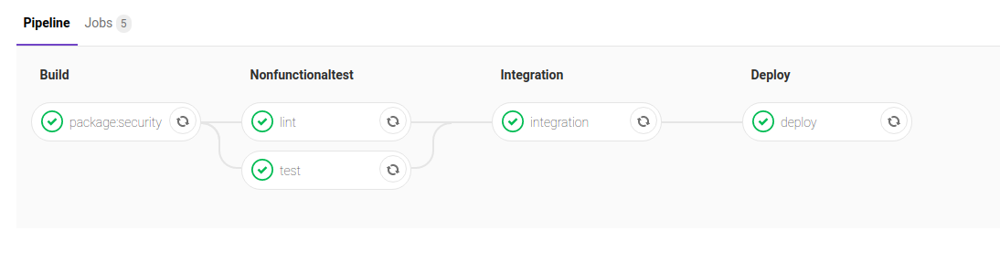

# Nowcasting Tool

This is a nowcasting tool to help countries predict their RGDP growth given the economic activities of other countries.
The economic activities are reflected in trading data and stock price data.
In this way, we can predict their RGDP growth and speed up the release of estimation from quarterly or annually to monthly.

This tool is built using Python 3.7 (numpy, pandas, and tensorflow), Docker, docker-compose, and Gitlab CI/CD

There are 4 stages which run in series:
* Build: to check dependencies
* Nonfunctionaltest: to check code readibility and security
* Integration: to check service integration by reviewing its inputs and outputs
* Deploy: After all previous steps are satisfied, we will automatically deployed it on cloud

## How to run
* Install prerequisites: Python 3.7 with libraries such as numpy, pandas, and tensorflow, Docker, and docker-compose.
* git clone https://github.com/erelsoftbakedcookies/nowcasting/
* ./run.sh

## Outputs
* We can access http://localhost:5000/files to get list of models
* We can download it by typing http://localhost:5000/files/put_filename_here

